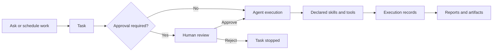
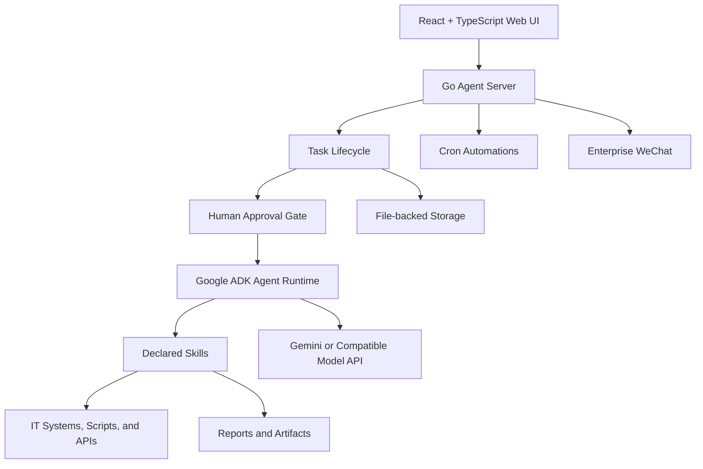

# NetX AI

<p align="center">
  <strong>Lightweight AI operations for IT teams.</strong>
</p>

<p align="center">
  Turn operational runbooks into auditable tasks, scheduled automations, and downloadable reports—with human approval for sensitive work.
</p>

<p align="center">
  <a href="README.md">English</a> ·
  <a href="README.zh-CN.md">简体中文</a> ·
  <a href="#quick-start">Quick Start</a> ·
  <a href="docs/README.md">Documentation</a>
</p>

NetX AI is a lightweight, self-hosted AI operations workspace for IT teams. It combines agent execution, task management, human approval, scheduled automation, execution records, and report artifacts in one simple system.

It is designed for IT operations, SRE, DevOps, platform, network, cloud, database, and security teams that want to use AI with their existing runbooks, scripts, and APIs—without adopting a heavyweight AI platform.

## Why NetX AI?

Operational AI needs more than a chat box:

- Every request should become a trackable task.
- Sensitive work should wait for a human decision.
- Tool execution should be inspectable and auditable.
- Recurring checks should run automatically.
- Reports should be saved as real artifacts.
- Credentials and operational data should remain in your environment.
- Extending the agent should be as simple as adding Markdown, YAML, Shell, or Python.

NetX AI is built around those requirements.

## How It Works



## Core Features

### Task-driven operations

Every operational request becomes a Task with an instruction, lifecycle status, agent responses, tool calls, execution timing, errors, approval records, and generated artifacts.

### Human-in-the-loop

Tasks that require approval pause in `AWAITING_INPUT` before agent execution. An operator can review and approve or reject the task in the web UI. NetX AI records the decision, operator, timestamp, and resulting state transition.

> AI proposes. Humans authorize. NetX AI records the decision.

The current implementation provides a task-level approval gate before execution. Fine-grained approval during an individual tool call is not yet implemented, and write-capable skill actions remain blocked by the read-only runner.

### Auditable execution

Inspect agent responses and skill calls from the Task detail page, including structured inputs and outputs, status, duration, errors, and locally persisted tool traces.

### Scheduled automations

Turn recurring operational work into scheduled automations. Each run creates a regular Task, preserving the same status, records, approval context, and artifacts as manually created work.

### Reports and artifacts

Skills can generate HTML, Markdown, JSON, or other files as task artifacts. The UI supports task association, preview, download, and artifact history.

### Extensible operational skills

Skills are reviewable, file-based capabilities built from:

- `SKILL.md` for agent instructions.
- `tools.yaml` for declared actions and execution policy.
- Shell, Python, JavaScript, or other scripts for implementation.
- A standard structured `SkillOutput` envelope.

### Team notifications

Enterprise WeChat can notify a team when automation runs finish or when a task is waiting for approval. Approval still happens in the NetX AI UI so that the decision remains part of the task history.

## Lightweight by Design

- A Go backend and React frontend packaged as one self-hosted application.
- Docker Compose for a small deployment footprint.
- File-backed storage with no external database required to get started.
- Bring your own Gemini endpoint or Gemini-compatible relay.
- Simple file-based skills instead of a separate plugin platform.
- Suitable for a laptop, VM, or internal server before moving to a larger deployment.

## Frontend

The operator workspace is built with React, TypeScript, Vite, Tailwind CSS, and Radix UI.

It provides:

- AgentSpace administration.
- Chat and Task creation.
- Live Task status and execution history.
- Human approval controls.
- Skill and tool-call inspection.
- Automation management.
- Artifact preview and download.
- Model, runtime variable, and integration configuration.

The frontend is not only a chat interface. It is the control plane for creating, approving, monitoring, and auditing AI-assisted IT operations.

## Backend

The backend is a Go service built on Google Agent Development Kit (ADK). It provides:

- Agent and model runtime management.
- Task lifecycle and cancellation.
- Human approval state transitions.
- Skill discovery and read-only execution.
- Scheduled automation with cron.
- Execution records and local tool traces.
- File-backed configuration and persistence.
- Artifact collection and task association.
- Enterprise WeChat notifications.
- HTTP JSON APIs consumed by the React frontend.

## Architecture



The browser communicates with a single Go service. The backend manages task state, approval, agent execution, skills, automations, records, and artifacts. Skills connect the agent to user-controlled IT systems through declared and reviewable actions.

## Quick Start

### Docker Compose

```bash
git clone https://github.com/xuyun-io/netx-scan-ai.git
cd netx-scan-ai
cp agent-server/config/app.yaml.example agent-server/config/app.yaml
docker compose up --build
```

Open:

```text
http://localhost:8080
```

Before using an agent, create an AgentSpace in the Admin UI and configure:

- A Gemini model and API key, or a Gemini-compatible relay.
- Runtime environment variables required by your skills.
- An optional Enterprise WeChat webhook.

For production settings, see [Deployment](docs/deployment.md) and [Configuration](docs/configuration.md).

### Local development

Start the backend:

```bash
cd agent-server
cp config/app.yaml.example config/app.yaml
go run .
```

Start the frontend in another terminal:

```bash
cd agent-ui
npm install
npm run dev
```

Open `http://localhost:5173`. The backend listens on `http://127.0.0.1:8080` by default.

## Example: From Runbook to Report

The bundled Chain287 inspection demonstrates a complete operational workflow. An operator asks NetX AI to run an inspection and generate a report. A single declared skill then:

1. Runs the required read-only chain and validator checks.
2. Validates that every required check completed.
3. Preserves structured execution results.
4. Generates an HTML health report.
5. Saves the report as a Task artifact.

Chain287 is an example skill, not a product limitation. The same model can be used for infrastructure checks, endpoint health, cloud inventory, CI/CD status, network diagnostics, database checks, security reviews, and internal IT reporting.

## Core Concepts

- **AgentSpace**: An isolated workspace containing model settings, runtime variables, integrations, conversations, Tasks, automations, and artifacts.
- **Task**: The unit of execution and audit, containing status, records, approval information, output, and artifacts.
- **Automation**: A schedule that creates and runs Tasks automatically.
- **Skill**: A declared operational capability the agent can load and execute.
- **Artifact**: A generated report or file persisted and associated with a Task.

## Model Providers

Direct Gemini:

```yaml
llm:
  provider: gemini
  model: gemini-2.5-pro
  apiKey: your-gemini-api-key
```

Gemini-compatible relay:

```yaml
llm:
  provider: gemini-relay
  model: gemini-2.5-pro
  apiKey: your-relay-api-key
  baseUrl: https://relay.example.com
```

`baseUrl` must be the relay root URL and must not include `/v1beta`. Model configuration is scoped to an AgentSpace. Application runtime configuration belongs in `agent-server/config/app.yaml`.

## Project Layout

```text
netx-ai/
├── agent-server/      # Go API, ADK runtime, Task engine, scheduler, skills
├── agent-ui/          # React and TypeScript operator workspace
├── docs/              # Architecture, APIs, deployment, and operations
├── k8s/               # Kubernetes starter manifests
├── Dockerfile
└── docker-compose.yml
```

## Development

Backend checks:

```bash
cd agent-server
go test ./...
```

Frontend build:

```bash
cd agent-ui
npm install
npm run build
```

## Security

- Do not commit `agent-server/config/app.yaml`.
- Never commit model API keys, webhook URLs, tokens, or private service endpoints.
- Review every Skill before enabling it in a trusted environment.
- Keep operational Skills read-only unless a separately reviewed write workflow exists.
- The current runner rejects non-read-only and approval-required Skill actions.
- Use authentication and network access controls for non-local deployments.
- Back up `agent-server/data/agents` before upgrades.

See [Skills and Tools](docs/skills-and-tools.md), [Operations](docs/operations.md), and [Architecture](docs/architecture.md) for details.

## Documentation

- [Documentation index](docs/README.md)
- [Architecture](docs/architecture.md)
- [Configuration](docs/configuration.md)
- [Development](docs/development.md)
- [Deployment](docs/deployment.md)
- [API Reference](docs/api.md)
- [Skills and Tools](docs/skills-and-tools.md)
- [Integrations](docs/integrations.md)
- [Operations](docs/operations.md)

## License

An open-source license has not yet been added. Until a license is published, treat this repository as source-available for evaluation rather than licensed open-source software.
