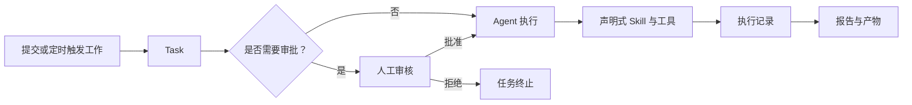
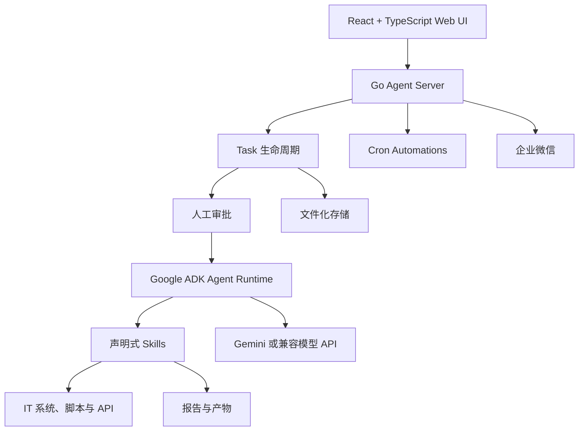

# NetX AI

<p align="center">
  <strong>面向 IT 团队的轻量级 AI 运维工作台。</strong>
</p>

<p align="center">
  将运维 Runbook 转化为可审计任务、定时自动化和可下载报告，并通过人工审批控制敏感工作。
</p>

<p align="center">
  <a href="README.md">English</a> ·
  <a href="README.zh-CN.md">简体中文</a> ·
  <a href="#快速开始">快速开始</a> ·
  <a href="docs/README.md">项目文档</a>
</p>

NetX AI 是面向 IT 团队的轻量级、自托管 AI 运维工作台，将 Agent 执行、任务管理、人工审批、定时自动化、执行记录和报告产物整合在一个简单系统中。

它适用于 IT 运维、SRE、DevOps、平台工程、网络、云、数据库和安全团队，让团队能够基于已有 Runbook、脚本与 API 使用 AI，而不必部署沉重的 AI 平台。

## 为什么选择 NetX AI？

真正的 AI 运维不能只有一个聊天框：

- 每项请求都应该成为可跟踪的任务。
- 敏感工作应该等待人工决策。
- 工具执行过程应该可以检查和审计。
- 重复检查应该能够自动定时运行。
- 报告应该保存为真实产物。
- 凭证和运维数据应该留在用户自己的环境中。
- 扩展 Agent 应该像添加 Markdown、YAML、Shell 或 Python 文件一样简单。

NetX AI 围绕这些需求构建。

## 工作流程



## 核心功能

### 任务驱动的 IT 运维

每项运维请求都会成为一个 Task，包含原始指令、生命周期状态、Agent 回复、工具调用、执行耗时、错误、审批记录以及生成的产物。

### Human-in-the-loop

需要审批的 Task 会在 Agent 执行前暂停于 `AWAITING_INPUT`。操作人员可以在 Web UI 中检查任务并批准或拒绝。NetX AI 会记录决策、操作人员、时间以及后续状态变化。

> AI 提出执行方案，人类负责授权，NetX AI 记录整个决策过程。

当前实现提供的是 Agent 执行前的任务级审批。单个工具调用执行过程中的细粒度动态审批尚未实现，带写能力的 Skill action 仍会被只读 Runner 拒绝。

### 可审计执行

可以在 Task 详情页检查 Agent 回复和 Skill 调用，包括结构化输入输出、状态、耗时、错误以及本地保存的工具 Trace。

### 定时自动化

将重复运维工作转化为定时 Automation。每次运行都会创建普通 Task，并保留与手动任务一致的状态、记录、审批上下文和产物。

### 报告与产物

Skill 可以生成 HTML、Markdown、JSON 或其他文件作为任务产物。前端支持任务关联、在线预览、下载和产物历史。

### 可扩展运维 Skill

Skill 是可审查的文件化能力，包括：

- 使用 `SKILL.md` 编写 Agent 指令。
- 使用 `tools.yaml` 声明 action 和执行策略。
- 使用 Shell、Python、JavaScript 或其他脚本实现能力。
- 使用统一的结构化 `SkillOutput` 返回结果。

### 团队通知

企业微信可以在自动化完成或 Task 等待审批时通知团队。最终审批仍然在 NetX AI UI 中完成，确保决策进入任务历史记录。

## 轻量级设计

- Go 后端与 React 前端组合成一个自托管应用。
- 使用 Docker Compose 即可进行小规模部署。
- 默认采用文件存储，开始使用时无需外部数据库。
- 支持自带 Gemini 模型端点或 Gemini 兼容中转服务。
- 使用简单的文件化 Skill，无需独立插件平台。
- 可以从笔记本、虚拟机或内部服务器开始部署。

## 前端实现

操作工作台使用 React、TypeScript、Vite、Tailwind CSS 和 Radix UI 构建。

前端提供：

- AgentSpace 管理。
- Chat 和 Task 创建。
- Task 实时状态和执行历史。
- 人工审批操作。
- Skill 与工具调用检查。
- Automation 管理。
- 产物预览和下载。
- 模型、运行变量与集成配置。

前端不只是聊天界面，而是 IT 团队创建、审批、监控和审计 AI 运维工作的控制台。

## 后端实现

后端是基于 Google Agent Development Kit（ADK）构建的 Go 服务，负责：

- Agent 与模型运行时管理。
- Task 生命周期和取消操作。
- 人工审批状态流转。
- Skill 发现和只读执行。
- 基于 Cron 的定时自动化。
- 执行记录和本地工具 Trace。
- 文件化配置与持久化。
- 产物收集及 Task 关联。
- 企业微信通知。
- 为 React 前端提供 HTTP JSON API。

## 系统架构



浏览器只需要与一个 Go 服务通信。后端统一管理任务状态、审批、Agent 执行、Skills、Automations、记录和产物。Skills 通过声明清晰、可供审查的 action，将 Agent 连接到用户控制的 IT 系统。

## 快速开始

### Docker Compose

```bash
git clone https://github.com/xuyun-io/netx-scan-ai.git
cd netx-scan-ai
cp agent-server/config/app.yaml.example agent-server/config/app.yaml
docker compose up --build
```

打开：

```text
http://localhost:8080
```

使用 Agent 前，需要在管理界面创建 AgentSpace 并配置：

- Gemini 模型和 API Key，或 Gemini 兼容中转服务。
- Skill 所需的运行时环境变量。
- 可选的企业微信 Webhook。

生产环境设置请参阅[部署文档](docs/deployment.md)和[配置文档](docs/configuration.md)。

### 本地开发

启动后端：

```bash
cd agent-server
cp config/app.yaml.example config/app.yaml
go run .
```

在另一个终端启动前端：

```bash
cd agent-ui
npm install
npm run dev
```

打开 `http://localhost:5173`。后端默认监听 `http://127.0.0.1:8080`。

## 示例：从 Runbook 到报告

内置的 Chain287 巡检展示了一套完整运维流程。操作人员要求 NetX AI 执行巡检并生成报告，一个声明式 Skill 随后会：

1. 执行所需的只读链与验证者检查。
2. 验证每一项必需检查均已完成。
3. 保存结构化执行结果。
4. 生成 HTML 健康巡检报告。
5. 将报告保存为 Task 产物。

Chain287 只是示例 Skill，并不是产品限制。同样的模式可以用于基础设施检查、服务可用性、云资源清单、CI/CD 状态、网络诊断、数据库检查、安全审查和内部 IT 报告。

## 核心概念

- **AgentSpace**：相互隔离的工作空间，包含模型设置、运行变量、集成、对话、Tasks、Automations 和产物。
- **Task**：执行和审计的基本单位，包含状态、记录、审批信息、输出和产物。
- **Automation**：按照计划自动创建和运行 Task。
- **Skill**：Agent 可以加载和执行的声明式运维能力。
- **Artifact**：由 Task 生成、保存并与 Task 关联的报告或文件。

## 模型提供方

直接使用 Gemini：

```yaml
llm:
  provider: gemini
  model: gemini-2.5-pro
  apiKey: your-gemini-api-key
```

使用 Gemini 兼容中转服务：

```yaml
llm:
  provider: gemini-relay
  model: gemini-2.5-pro
  apiKey: your-relay-api-key
  baseUrl: https://relay.example.com
```

`baseUrl` 必须是中转服务根地址，不能包含 `/v1beta`。模型配置属于 AgentSpace，应用运行配置位于 `agent-server/config/app.yaml`。

## 项目结构

```text
netx-ai/
├── agent-server/      # Go API、ADK Runtime、Task 引擎、调度器、Skills
├── agent-ui/          # React + TypeScript 操作工作台
├── docs/              # 架构、API、部署与运维文档
├── k8s/               # Kubernetes 基础清单
├── Dockerfile
└── docker-compose.yml
```

## 开发与验证

后端测试：

```bash
cd agent-server
go test ./...
```

前端构建：

```bash
cd agent-ui
npm install
npm run build
```

## 安全说明

- 不要提交 `agent-server/config/app.yaml`。
- 禁止提交模型 API Key、Webhook URL、Token 或内部服务地址。
- 在可信环境启用 Skill 前，应先审查其内容。
- 除非存在经过单独审核的写操作流程，否则运维 Skill 应保持只读。
- 当前 Runner 会拒绝非只读或声明需要审批的 Skill action。
- 非本地部署必须配置认证与网络访问控制。
- 升级前备份 `agent-server/data/agents`。

详细信息请参阅 [Skills and Tools](docs/skills-and-tools.md)、[Operations](docs/operations.md) 和 [Architecture](docs/architecture.md)。

## 项目文档

- [文档索引](docs/README.md)
- [系统架构](docs/architecture.md)
- [应用配置](docs/configuration.md)
- [开发指南](docs/development.md)
- [部署指南](docs/deployment.md)
- [API Reference](docs/api.md)
- [Skills and Tools](docs/skills-and-tools.md)
- [集成说明](docs/integrations.md)
- [运维说明](docs/operations.md)

## 许可证

项目暂未添加开源许可证。在正式发布许可证之前，请将本仓库视为可供评估的源代码，而不是已经完成授权的开源软件。
